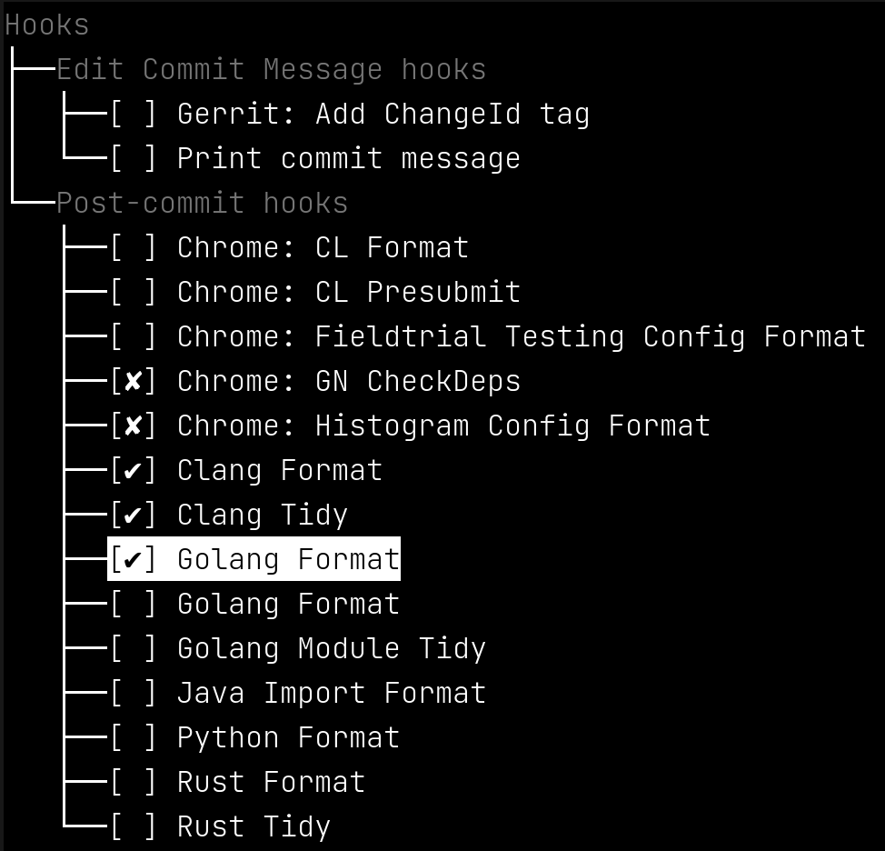

# GitHooks
## Introduction

This utility, like few others, allows the user to build and re-use the library
of hooks.

The utility is designed to work either as a standalone tool, a hook itself, and
may be used as a git command, once named `git-hooks` and installed anywhere in 
`PATH`.

## Building

To build this tool you need `golang`, version at minimum 1.18. When ready, 
simply execute:

```
go build .
```

## Installation

While not required, I would encourage anyone to create a git alias for this 
command by naming it `git-hooks`. The rest of this document will assume this is
what you've done.

The utility requires a configuration file describing a list of commands for
every hook type. The config file must be named `.gitconfig.json` and be
placed in the user's home directory. An exaple configuration file can be found
in the source repository -- simply copy it as follows:

```
cp githooks.json.example ~/.githooks.json
```

## Config file

The config file is a simple JSON file with the following structure:

### Top-level
```
{
    "version": number,            // Configuration file version.
    "hooks":   Map<string, Hook>  // Map git hook to list of actions.
}
```

Currently only `version` value of `1` is supported. The field `hooks` 
describes possible choices of actions to be run for particular git hook.
The key for `hooks` map is always the hook name, eg. `post-commit`.

Since git hook system is flexible, permitting addition of any new hooks,
this mechanism does not focus on any names in particular, allowing the user
to specify what to override.

### Hook
```
{
    "name":    String,             // Human-readable name.
    "actions": Map<string, Action> // Map of ID to action definition.
}
```

Value of `name` is used strictly to present the hook to the user in a friendly 
format.

The `actions` map is a list of possible actions. Actions are be by default 
disabled for every repo. The ID of an `action` (map key) is used to retain any
configuration for this action. Presently this means only whether an action is 
_enabled_ for particular repository.

### Action
```
{
    "name":        string,  // Human-readable name.
    "priority":    number,  // Execution priority: lower numbers are executed first.
    "runType":     string,  // Either "perCommit" or "perFile", see below.
    "filePattern": string,  // File pattern to match this action against.
    "shellCmd":    string[] // Shell command and arguments with some extra options - see below.
}
```

- `name` is used strictly to present the action to the user in a 
friendly format.
- `priority` is used during execution to rearrange actions so that those with 
lower value run before ones with higher priority value.
- `runType` specifies how the action is run. Two values are possible:
  - `perFile` runs an action for every file individually. The name of the file 
  can be passed to the action at any specific position (see `shellCmd`).
  - `perCommit` runs an action only once.  No file names are given right now  
  though.
- `filePattern` is used to determine whether there is a need to run the action.
  Before actions are run, the tool internally evaluates list of recently 
  modified files, and matches these against this pattern. If a match is found, 
  the action is run. **Note** that only basename is matched right now.
- `shellCmd` is a command and its list of arguments that would be passed to 
  `exec`.
  - The first argument is _always_ the _command_ itself. The tool 
    internally attempts to search for the _command_ in the repository, so the 
    path relative to repository root may be given. When not found, the tool next
    attempts to locate the _command_ in `PATH`. When that fails, action will 
    not run.
  - At any place, the user can put the `<file>` placeholder. This placeholder
    is translated to a matching filename (see `filePattern`).
  - For eligible hooks, it is also possible to put `<args>`, which forwards the
    arguments passed to the original hook over to the eligible action.

## Usage

The utility manipulates the repository in CWD. In other words, before running 
the command you must change the directory first.

The utility has three modes of operation

### Setup

Before the tool can execute, it must be installed. This _must_ be run once for 
every repository where the tool should run, and every time new `hooks` are 
defined (but not where new `actions` are added).

```
git hooks install
```
This command will create symbolic links in `.git/hooks` folder pointing to the 
command itself.

### Configuration

The next thing to do is toggle which of the user-supplied actions should run in 
this repository. The configuration UI is started automatically after 
installation but also upon invoking siply:

```
git hooks
```
Once done, the user should be offered a simple termui view:



The currently modified item gets the highlight.
- Action is disabled when the box is cleared.
- Action is enabled and active when it gets the tick mark.
- Action is enabled but inactive when it gets the cross. This typically 
  indicates that the corresponding _command_ is not found.

**Note** The configuration is persisted in local git config: running this 
command will add new entries that you can inspect by running

```
git config -e
```

### Execution

There's two ways to run the hooks
- triggering them by running a `git` command that triggers execution, or
- running them directly via `git hooks <hook>` (eg. `git hooks post-commit`).
